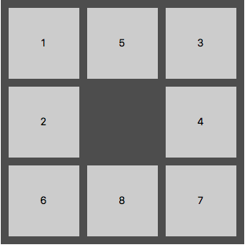
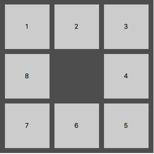

# npuzzle

Npuzzle is a 42 project where you have to propose a solver for any npuzzle (most known npuzzles are 8-puzzles and 15-puzzles). This project was realized with [terngkub](https://github.com/terngkub).

The npuzzle is a game consisting in moving a blank tile in order to reorder all the tiles of the puzzle. The order wanted at the end is called the goal and it can change depending on the problem. For the npuzzle project the goal was a spiral version of the basic goal (which is linear).

starting 8-puzzle             |  goal 8-puzzle
:-------------------------:|:-------------------------:
  |  

The program must work on any size. But factually, the program will limited by the memory of the system depending on the algorithm used.

## Usage


Usage:
```
python3 main.py [-A astar|uniform|greedy] [-H hamming|manhattan|linear] [-g] -f puzzle_file
```

Examples:
```
python3 main.py -f puzzles/solvable.npuzzle
python3 main.py -A greedy -H hamming -f puzzles/solvable.npuzzle
```

## Bonus

3 bonus were done on this project:
- implementation of the linear_conflict heuristic from the original paper (other explanations on internet were not complete enough to implement it correctly)
- benchmarking tool to measure the performances of the algorithms / heuristics
- graphical interface to see all the movements needed to solve the npuzzle

Mark: (121/121)
